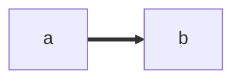

# Trial and Error

## Embed in WIKI

Both Azure Devops and GitHub Markdown support embedding Mermaid, but they do it differently.

If I was to embed this diagram

``` text
flowchart LR
    a ==> b
```


### Azure DevOps
The mermaid block will start with ":::mermaid" and end with ":::"
```markdown
:::mermaid
flowchart LR
    a ==> b
:::
```
### GitHub
Since this is a GitHub markdown file I'm replacing the back tick character ("`") with the single quote character ("'"), otherwise things will be crazy.

The mermaid block will start with "\`\`\`mermaid" and end with "\`\`\`"
```markdown
'''mermaid
flowchart LR
    a ==> b
'''
```

Mermaid features support varies depending on where you run it.

---
Back to [main read md](readme.md).

