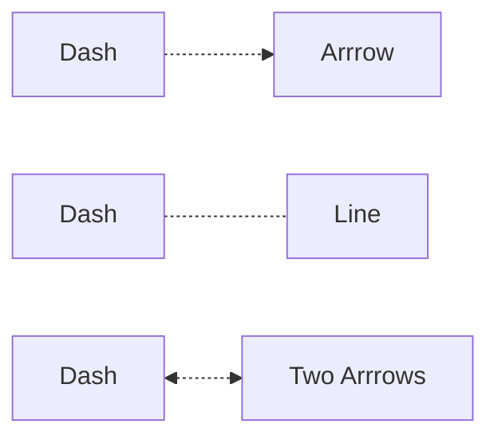
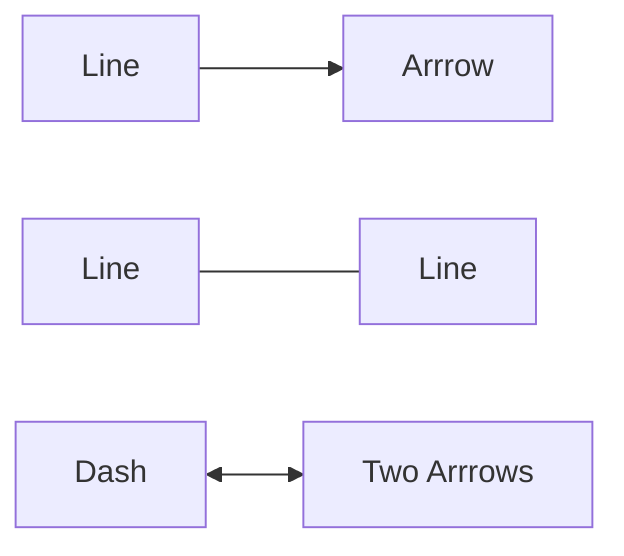
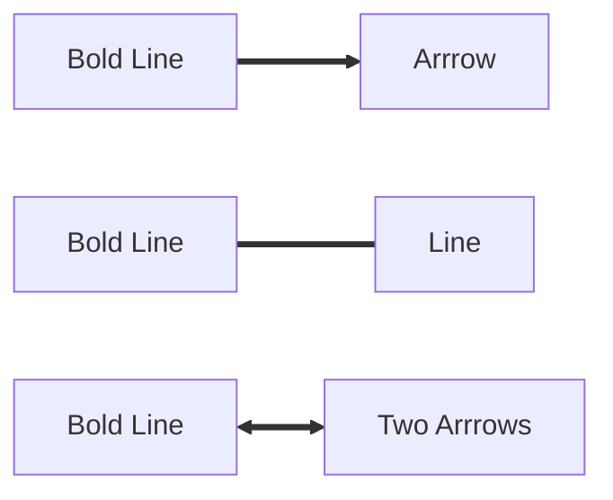
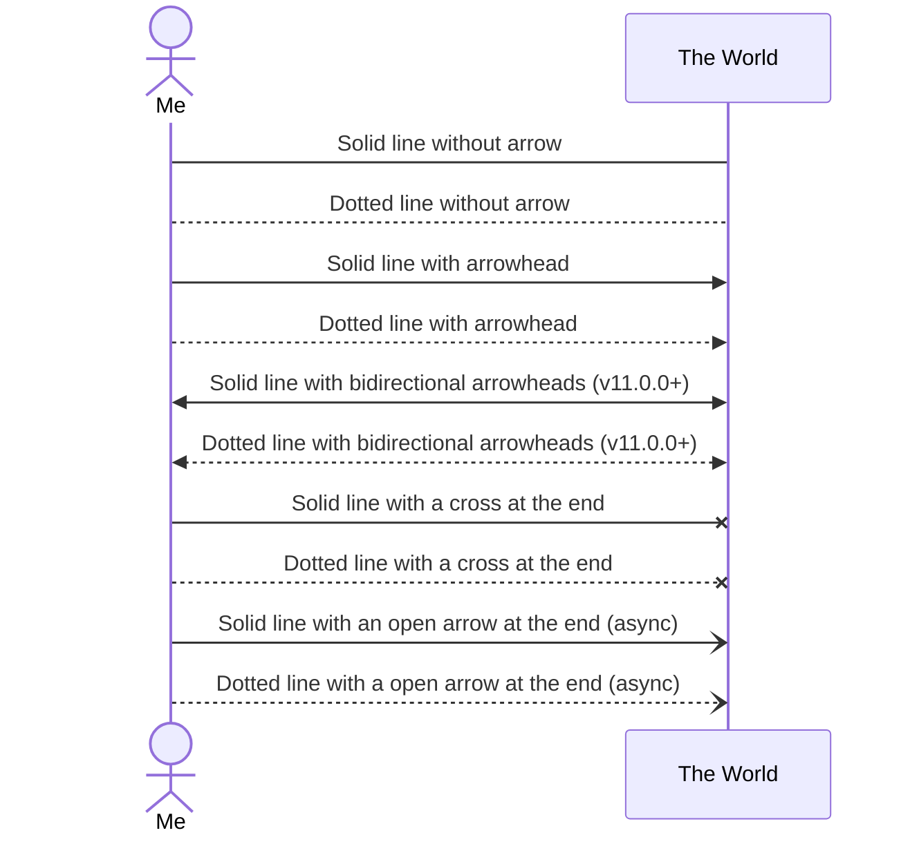

# Connectors

## flowchart

### Dashed
```text
flowchart LR
  A[Dash]-.->B[Arrrow]
  C[Dash]-.-D[Line]
  E[Dash]<-.->F[Two Arrrows]
```

### Line
```text
flowchart LR
  A[Line]-->B[Arrrow]
  C[Line]---D[Line]
  E[Dash]<-->F[Two Arrrows]
```

### Bold Line
```text
flowchart LR
  I[Bold Line]==>J[Arrrow]
  K[Bold Line]===L[Line] 
  E[Bold Line]<==>F[Two Arrrows]
```

## sequenceDiagram
See [Messages](https://mermaid.js.org/syntax/sequenceDiagram.html#messages) on the mermaid site.

```text
sequenceDiagram
    actor me as Me
    participant world as The World

    me -> world: Solid line without arrow
    me --> world:	Dotted line without arrow
    me ->> world: Solid line with arrowhead
    me -->> world: Dotted line with arrowhead
    me <<->> world: Solid line with bidirectional arrowheads (v11.0.0+)
    me <<-->> world: Dotted line with bidirectional arrowheads (v11.0.0+)
    me -x world: Solid line with a cross at the end
    me --x world: Dotted line with a cross at the end
    me -) world: Solid line with an open arrow at the end (async)
    me --) world:	Dotted line with a open arrow at the end (async)
```



Back to [main read md](readme.md).
