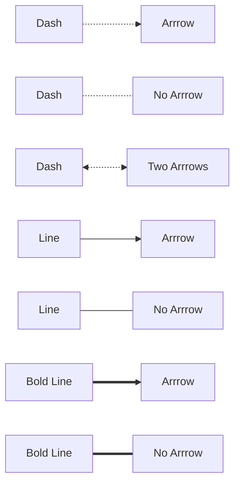

# Connectors

## flowchart

```mermaid
flowchart LR
  A[Dash]-.->B[Arrrow]
  C[Dash]-.-D[No Arrrow]
  M[Dash]<-.->N[Two Arrrows]
  E[Line]-->F[Arrrow]
  G[Line]---H[No Arrrow]
  I[Bold Line]==>J[Arrrow]
  K[Bold Line]===L[No Arrrow]
 
```