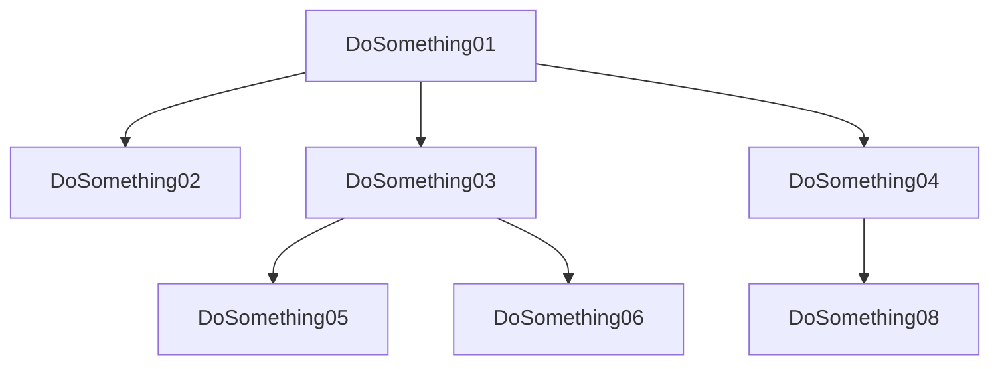
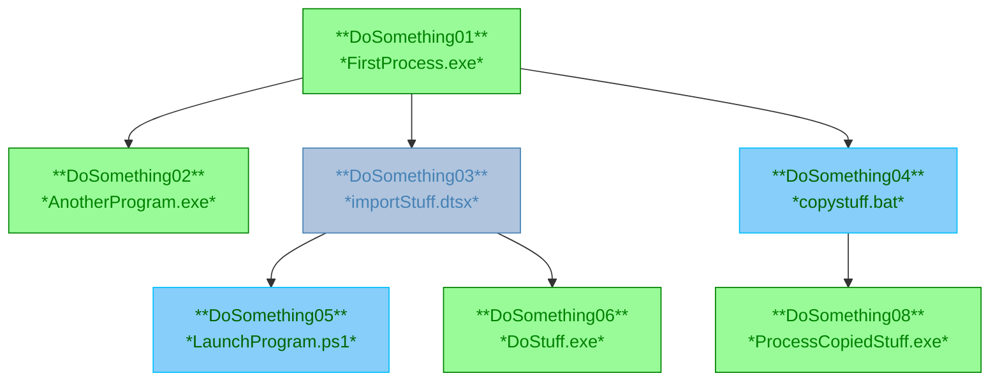
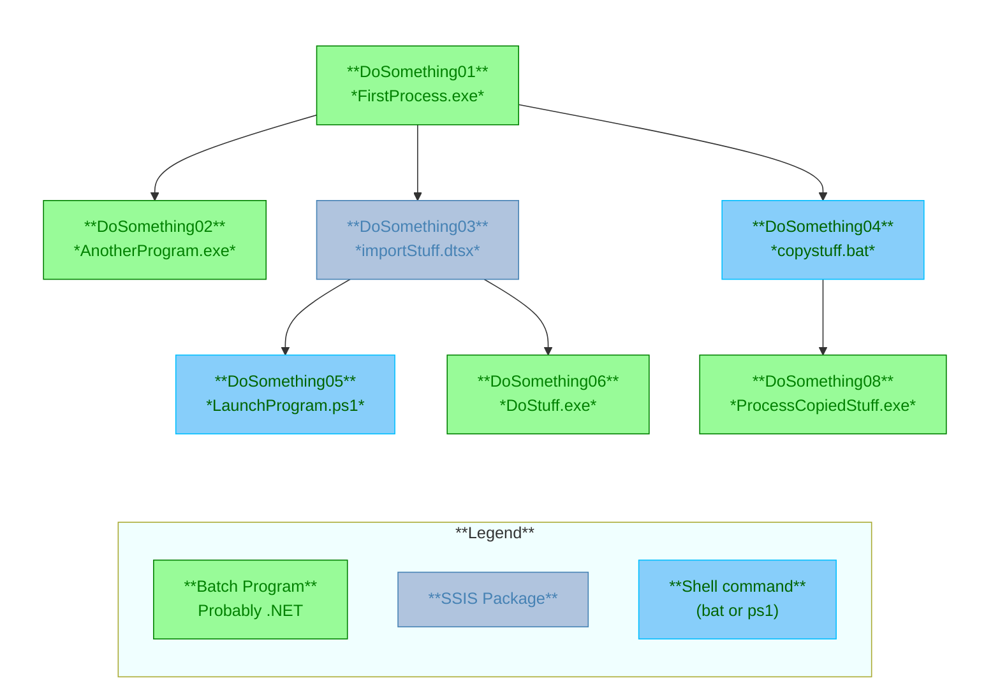

# List to Mermaid Example
This is a simplified example inspired from a real life situation from my job.
## Find a list to be graphed
Suppose we have have a list of processes for a task runner in an Excel workbook.

| Process       | Next
|---------------|-
| DoSomething01 | DoSomething02
| DoSomething01 | DoSomething03
| DoSomething01 | DoSomething04
| DoSomething03 | DoSomething05
| DoSomething03 | DoSomething06
| DoSomething04 | DoSomething08

In real life there was more data, I deleted the extra columns.
## Save file as CSV 

```csv
Process,Next
DoSomething01,DoSomething02
DoSomething01,DoSomething03
DoSomething01,DoSomething04
DoSomething03,DoSomething05
DoSomething03,DoSomething06
DoSomething04,DoSomething08
```
## Transform to Mermaid syntax
Reformat the list to match flowchart syntax (good use for multi cursor), add the chart type:
```text
flowchart TB
    DoSomething01 --> DoSomething02
    DoSomething01 --> DoSomething03
    DoSomething01 --> DoSomething04
    DoSomething03 --> DoSomething05
    DoSomething03 --> DoSomething06
    DoSomething04 --> DoSomething08
```


Here I replaced the `'`'s with `-->`'s and added the `flowchart TB` to the top.
## Add descriptions
Suppose I tracked down each of these processes and figured out some details on each one. Here is the list I came up with:
| Process | Executable | Type
|---------|------------|-
|DoSomething01|FirstProcess.exe|exec
|DoSomething02|AnotherProgram.exe|exec
|DoSomething03|importStuff.dtsx|ssis
|DoSomething04|copystuff.bat|cmd
|DoSomething05|LaunchProgram.ps1|cmd
|DoSomething06|DoStuff.exe|exec
|DoSomething08|ProcessCopiedStuff.exe|exec

```text
flowchart TB

    %% Relationships
    DoSomething01 --> DoSomething02
    DoSomething01 --> DoSomething03
    DoSomething01 --> DoSomething04
    DoSomething03 --> DoSomething05
    DoSomething03 --> DoSomething06
    DoSomething04 --> DoSomething08

    %% Declarations
    DoSomething01[**DoSomething01**<br/>*FirstProcess.exe*]
    DoSomething02[**DoSomething02**<br/>*AnotherProgram.exe*]
    DoSomething03[**DoSomething03**<br/>*importStuff.dtsx*]
    DoSomething04[**DoSomething04**<br/>*copystuff.bat*]
    DoSomething05[**DoSomething05**<br/>*LaunchProgram.ps1*]
    DoSomething06[**DoSomething06**<br/>*DoStuff.exe*]
    DoSomething08[**DoSomething08**<br/>*ProcessCopiedStuff.exe*]

    %% Classes
    class DoSomething01,DoSomething02,DoSomething06,DoSomething08 program
    class DoSomething03 ssis
    class DoSomething04,DoSomething05 cmd

    %% classDefs
    classDef program fill:PaleGreen,color:green,stroke:green
    classDef ssis fill:LightSteelBlue,color:SteelBlue,stroke:SteelBlue
    classDef cmd fill:LightSkyBlue,color:darkgreen,stroke:DeepSkyBlue
```

## Bonus: Add a Legend
Sometimes it is nice to see what the colors mean. Here ai put the legend in a subgraph. To avoid having the legend trample over the main graph, I put that in a subgraph and tried to hide it.
```text
flowchart LR

    %% Relationships
    DoSomething01 --> DoSomething02
    DoSomething01 --> DoSomething03
    DoSomething01 --> DoSomething04
    DoSomething03 --> DoSomething05
    DoSomething03 --> DoSomething06
    DoSomething04 --> DoSomething08

    %% Legend must be first to be at the bottom.
    subgraph legend[**Legend**]
        direction TB
        lProgram[**Batch Program**<br/>Probably .NET]:::program
        lSsis[**SSIS Package**]:::ssis
        lCmd["**Shell command**<br/>(bat or ps1)"]:::cmd
    end

    %% Declarations
    %% `&nbsp;` to hide the title (background and stroke are white to hide them too)
    subgraph network[&nbsp;]
        direction TB
        DoSomething01[**DoSomething01**<br/>*FirstProcess.exe*]
        DoSomething02[**DoSomething02**<br/>*AnotherProgram.exe*]
        DoSomething03[**DoSomething03**<br/>*importStuff.dtsx*]
        DoSomething04[**DoSomething04**<br/>*copystuff.bat*]
        DoSomething05[**DoSomething05**<br/>*LaunchProgram.ps1*]
        DoSomething06[**DoSomething06**<br/>*DoStuff.exe*]
        DoSomething08[**DoSomething08**<br/>*ProcessCopiedStuff.exe*]
    end

    %% Classes
    class DoSomething01,DoSomething02,DoSomething06,DoSomething08 program
    class DoSomething03 ssis
    class DoSomething04,DoSomething05 cmd

    %% classDefs
    classDef program fill:PaleGreen,color:green,stroke:green
    classDef ssis fill:LightSteelBlue,color:SteelBlue,stroke:SteelBlue
    classDef cmd fill:LightSkyBlue,color:darkgreen,stroke:DeepSkyBlue

    %% sub graph styles
    %% white on white to hide
    style network fill:white, stroke:white
    style legend fill:azure
```


# Generating Mermaid in code

See my [parse.project.assets](https://github.com/jrcs3/parse.project.assets) project on github for an example of a program that generates Mermaid diagrams in C#.

---

Back to [main read md](readme.md).