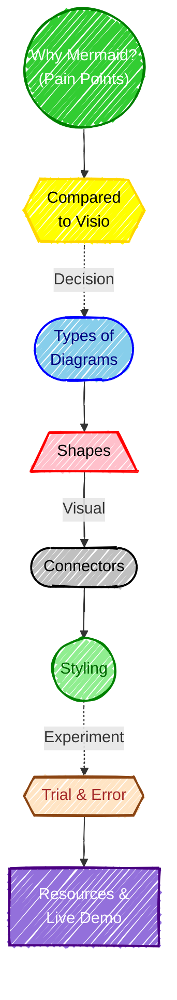

# Introduction to Mermaidjs

[Mermaid | Diagramming and charting tool](https://mermaid.js.org/) is the projects site, and the [Github site](https://github.com/mermaid-js/mermaid) if you want to see the source code.

[Mermaid Live Editor](https://mermaid.live/) is a good tool to experiment with Mermaid.

[Markdown Preview Enhanced](https://marketplace.visualstudio.com/items?itemName=shd101wyy.markdown-preview-enhanced) is a VS Code extension that supports Mermaid.

- [Compared to Visio](vs-visio.md)
- [Types of Diagrams](types-of-diagrams.md)
- [Shapes](shapes.md)
- [Connectors](connectors.md)
- [Styling](style.md)
- [Trial &amp; Error](Trial-and-error.md)

---

## Agenda

