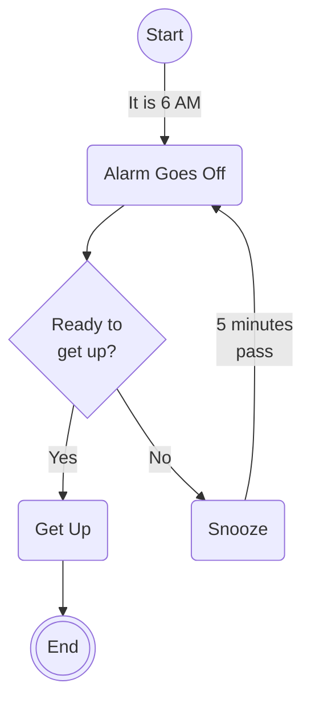
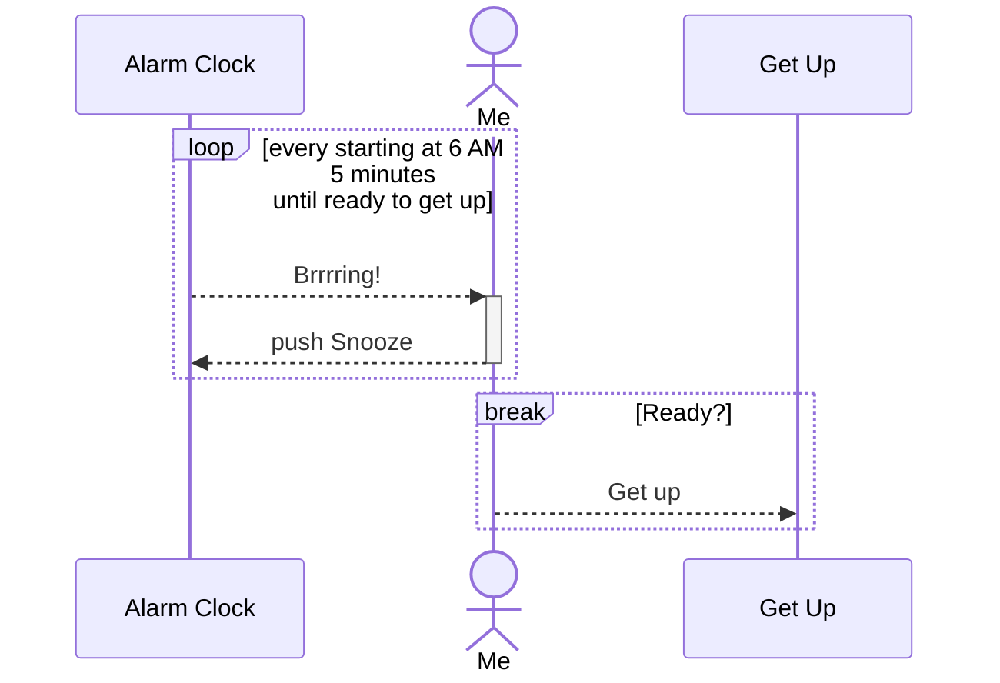
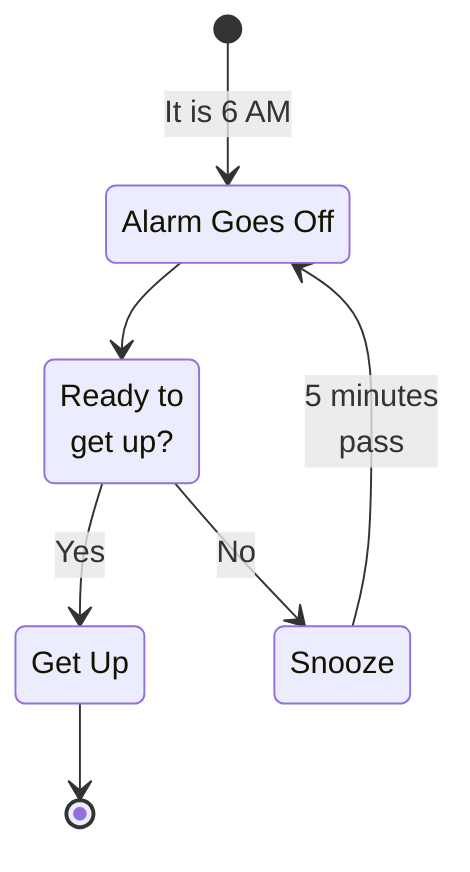
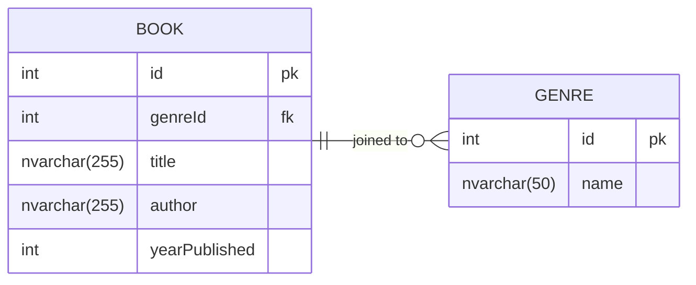
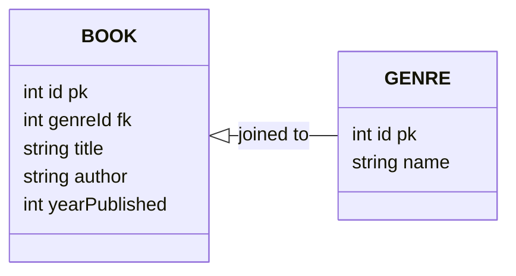

# Types of Diagrams

## flowchart 

Most of the diagrams I've written are flowchart diagrams. I can stretch visualize most of what I need.

See [Flowchart Syntax | Mermaid](https://mermaid.js.org/syntax/flowchart.html)

``` text
flowchart TB
    A((Start)) --> |It is 6 AM| B(Alarm Goes Off)
    B --> C{Ready to<br/>get up?}
    C --> |Yes| E(Get Up)
    C --> |No| D(Snooze)
    D --> |5 minutes<br/>pass| B
    E --> F(((End)))
```



## sequenceDiagram
I think I've used this twice in the wild. 

See [Sequence diagrams | Mermaid](https://mermaid.js.org/syntax/sequenceDiagram.html)

``` text
sequenceDiagram
  participant Alarm as Alarm Clock
  actor me as Me
  participant Up as Get Up
  loop every starting at 6 AM<br/>5 minutes<br/> until ready to get up
    Alarm-->>+me: Brrrring!
    me-->>-Alarm: push Snooze
  end
  break Ready?
    me-->>Up: Get up
  end
```



## stateDiagram-v2

See [Sequence diagrams | Mermaid](https://mermaid.js.org/syntax/stateDiagram.html)


``` text
stateDiagram-v2
    %% Node Defs
    B : Alarm Goes Off
    C : Ready to<br/>get up?
    E : Get Up
    D : Snooze
    %% Relationships
    [*] --> B : It is 6 AM
    B --> C
    C --> E : Yes
    C --> D : No
    D --> B : 5 minutes<br/>pass
    E --> [*]
```


## erDiagram



See [Entity Relationship Diagrams | Mermaid](https://mermaid.js.org/syntax/entityRelationshipDiagram.html)

## classDiagram



See [Class diagrams | Mermaid](https://mermaid.js.org/syntax/classDiagram.html)


Back to [main read md](readme.md).